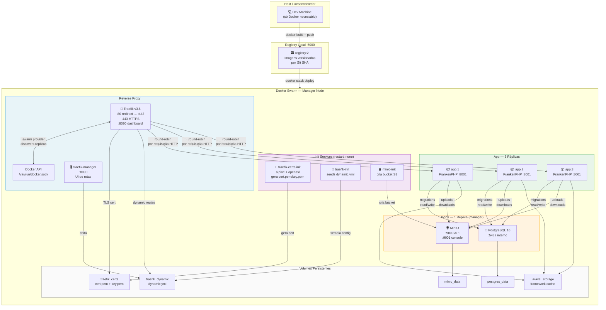
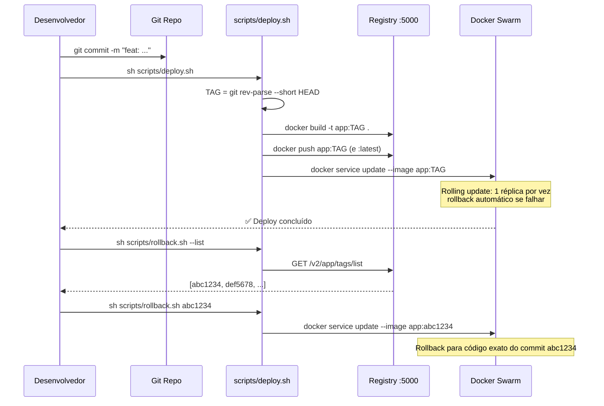

# Guia de Replicação — Laravel + Dokploy + Docker Swarm + Traefik HTTPS

Guia prático para replicar esta arquitetura em qualquer projeto Laravel do zero,
incluindo as lições aprendidas durante o desenvolvimento.

---

## Arquitetura



---

## Por que esta arquitetura?

| Problema | Solução adotada |
|---|---|
| Arquivos de upload perdidos entre redeploys | MinIO S3-compatible — storage centralizado fora da imagem |
| Sessões inválidas ao escalar horizontalmente | `SESSION_DRIVER=database` — sessões no PostgreSQL |
| Segredos no repositório git | `.dockerignore` exclui `.env`; variáveis injetadas em runtime |
| Load balancing só por conexão TCP | Traefik v3.6 + swarm provider — round-robin por requisição HTTP |
| HTTPS requer instalação no host | `traefik-certs-init` gera cert autoassinado via Alpine+openssl em runtime |
| Rollback sem rastreabilidade | Imagens tagueadas com Git SHA — rollback exato por commit |

---

## Pré-requisitos

Apenas **Docker** instalado. Nada mais.

```bash
# Verificar
docker --version          # >= 24.x
docker compose version    # >= 2.x
docker swarm --help       # deve existir
```

---

## Passo a Passo — Replicar do Zero

### 1. Estrutura de arquivos a criar

```
meu-projeto-laravel/
├── docker/
│   └── entrypoint.sh          ← script de boot do container
├── traefik/
│   ├── traefik.yml            ← config estática do Traefik
│   └── dynamic.yml            ← config dinâmica (TLS + rotas)
├── scripts/
│   ├── deploy.sh              ← build + tag + push + rolling update
│   └── rollback.sh            ← rollback por Git SHA
├── Dockerfile
├── Caddyfile
├── docker-compose.yml         ← dev local
├── docker-stack.yml           ← produção / Swarm
└── .dockerignore
```

### 2. Dockerfile

```dockerfile
FROM dunglas/frankenphp

# Extensões PHP necessárias
RUN install-php-extensions \
    bcmath ctype fileinfo json mbstring \
    pdo pdo_pgsql pdo_sqlite tokenizer xml zip intl

COPY --from=composer:latest /usr/bin/composer /usr/bin/composer

WORKDIR /app
COPY . /app

RUN composer install --no-dev --optimize-autoloader
RUN chmod -R 777 storage bootstrap/cache

COPY docker/entrypoint.sh /usr/local/bin/entrypoint.sh
RUN chmod +x /usr/local/bin/entrypoint.sh

ENTRYPOINT ["entrypoint.sh"]
CMD ["frankenphp", "run", "--config", "/app/Caddyfile"]
```

> **Lição aprendida #1:** Sempre instale `pdo_pgsql` explicitamente.
> A extensão não vem no FrankenPHP por padrão e o erro só aparece em runtime,
> não no build.

### 3. .dockerignore

```
.env
.env.*
!.env.example
.git
/vendor
/node_modules
/storage/app
/storage/framework/cache
/storage/framework/sessions
/storage/framework/views
/storage/logs
*.sqlite
*.sqlite-journal
docker-compose.yml
docker-stack.yml
/tests
phpunit.xml
README.md
```

> **Lição aprendida #2:** `COPY . /app` copia TUDO por padrão.
> Sem `.dockerignore`, o `.env` com segredos é embutido na imagem.
> O `.gitignore` não afeta o Docker — são sistemas independentes.

### 4. docker/entrypoint.sh

```sh
#!/bin/sh
set -e

# Aguardar PostgreSQL (crítico para Swarm onde não há depends_on)
echo "Waiting for database..."
until php -r "
try {
    \$dsn = getenv('DB_CONNECTION') . ':host=' . getenv('DB_HOST') .
            ';port=' . (getenv('DB_PORT') ?: 5432) .
            ';dbname=' . getenv('DB_DATABASE');
    new PDO(\$dsn, getenv('DB_USERNAME'), getenv('DB_PASSWORD'));
    exit(0);
} catch (Exception \$e) { exit(1); }
" 2>/dev/null; do
    echo "Database not ready, retrying in 2s..."
    sleep 2
done
echo "Database ready!"

# Garantir que os diretórios do framework existem (volume pode estar vazio)
mkdir -p /app/storage/framework/cache/data
mkdir -p /app/storage/framework/sessions
mkdir -p /app/storage/framework/views
mkdir -p /app/storage/logs
chmod -R 777 /app/storage /app/bootstrap/cache

# Migrations e cache
php artisan migrate --force
php artisan optimize

exec "$@"
```

> **Lição aprendida #3:** Em Docker Swarm, `depends_on` é **ignorado**.
> O entrypoint DEVE fazer o health check do banco por conta própria,
> caso contrário o app crasha antes do PostgreSQL subir.

> **Lição aprendida #4:** O volume montado em `storage/framework` começa vazio.
> Os subdiretórios (`cache`, `sessions`, `views`) precisam ser criados
> manualmente no entrypoint — sem isso, `php artisan optimize` falha com
> `"View path not found"`.

### 5. traefik/traefik.yml

```yaml
api:
  insecure: true
  dashboard: true

entryPoints:
  web:
    address: ":80"
    http:
      redirections:
        entryPoint:
          to: websecure
          scheme: https
          permanent: true
  websecure:
    address: ":443"

providers:
  # Swarm provider: descobre réplicas individualmente (round-robin real)
  # Requer Traefik v3.6+ — versões anteriores falham com Docker Desktop/WSL2
  swarm:
    exposedByDefault: false
    network: <nome-do-stack>_default   # ← ajustar para o nome do seu stack

  # File provider: TLS cert + rotas extras via traefik-manager
  file:
    directory: /etc/traefik/conf.d
    watch: true

log:
  level: INFO

accessLog:
  filePath: /var/log/traefik/access.log
```

> **Lição aprendida #5:** Use **Traefik v3.6+** obrigatoriamente.
> Versões anteriores (v3.0–v3.5) usam Docker client API v1.24,
> que o Docker Desktop moderno (Engine 29+) rejeita com
> `"Error response from daemon: "` (mensagem vazia).
> Corrigido no [issue #12253](https://github.com/traefik/traefik/issues/12253).

### 6. traefik/dynamic.yml

```yaml
# Gerenciado pelo traefik-manager (:8090)
http: {}

# TLS: certificado gerado pelo traefik-certs-init na primeira execução
tls:
  certificates:
    - certFile: /etc/traefik/certs/cert.pem
      keyFile: /etc/traefik/certs/key.pem
  stores:
    default:
      defaultCertificate:
        certFile: /etc/traefik/certs/cert.pem
        keyFile: /etc/traefik/certs/key.pem
```

> **Lição aprendida #6:** Em Traefik v3, `middlewares: {}` é **inválido**
> no file provider e causa erro de parse. Omita a seção ou use `http: {}`.

### 7. docker-stack.yml (estrutura essencial)

```yaml
configs:
  traefik_static:
    file: ./traefik/traefik.yml
  traefik_dynamic_init:
    file: ./traefik/dynamic.yml

services:
  traefik:
    image: traefik:v3.6
    ports:
      - "80:80"
      - "443:443"
      - "8080:8080"
    volumes:
      - /var/run/docker.sock:/var/run/docker.sock:ro
      - traefik_dynamic:/etc/traefik/conf.d
      - traefik_certs:/etc/traefik/certs:ro
      - traefik_logs:/var/log/traefik
    configs:
      - source: traefik_static
        target: /etc/traefik/traefik.yml
    deploy:
      replicas: 1
      placement:
        constraints:
          - node.role == manager

  app:
    image: <seu-registry>/meu-app:${TAG:-latest}
    deploy:
      replicas: 3
      update_config:
        parallelism: 1
        delay: 10s
        failure_action: rollback
      labels:
        # IMPORTANTE: em Swarm, labels do Traefik vão em deploy.labels
        # não no nível do serviço (que seriam labels do container)
        - traefik.enable=true
        - traefik.http.routers.app.rule=Host(`${APP_DOMAIN:-localhost}`)
        - traefik.http.routers.app.entrypoints=websecure
        - traefik.http.routers.app.tls=true
        - traefik.http.services.app.loadbalancer.server.port=8001

  traefik-certs-init:
    image: alpine:latest
    command:
      - sh
      - -c
      - |
        if [ ! -f /certs/cert.pem ]; then
          apk add --no-cache openssl >/dev/null 2>&1
          openssl req -x509 -nodes -newkey rsa:2048 -days 3650 \
            -keyout /certs/key.pem -out /certs/cert.pem \
            -subj '/CN=localhost/O=Dev/C=BR' \
            -addext 'subjectAltName=DNS:localhost,DNS:*.localhost,IP:127.0.0.1' \
            2>/dev/null
          echo 'Certificado TLS gerado.'
        else
          echo 'Certificado já existe.'
        fi
    volumes:
      - traefik_certs:/certs
    deploy:
      replicas: 1
      restart_policy:
        condition: none

  traefik-init:
    image: alpine:latest
    command:
      - sh
      - -c
      - "cp /init/dynamic.yml /conf.d/dynamic.yml && echo 'Dynamic config seeded.'"
    volumes:
      - traefik_dynamic:/conf.d
    configs:
      - source: traefik_dynamic_init
        target: /init/dynamic.yml
    deploy:
      replicas: 1
      restart_policy:
        condition: none

  postgres:
    image: postgres:16-alpine
    volumes:
      - postgres_data:/var/lib/postgresql/data
    deploy:
      replicas: 1
      placement:
        constraints:
          - node.role == manager  # volumes locais ficam fixos no nó

  minio:
    image: minio/minio:latest
    command: server /data --console-address ":9001"
    volumes:
      - minio_data:/data
    deploy:
      replicas: 1
      placement:
        constraints:
          - node.role == manager  # volumes locais ficam fixos no nó

volumes:
  traefik_certs:
  traefik_dynamic:
  traefik_logs:
  postgres_data:
  minio_data:
```

> **Lição aprendida #7:** Sempre adicione `placement.constraints: node.role == manager`
> para serviços com volumes locais (postgres, minio).
> Em Swarm multi-nó, o container pode ser agendado em qualquer nó.
> Se migrar de nó, o volume local anterior fica inacessível e os dados somem.

> **Lição aprendida #8:** Labels do Traefik em Swarm **devem estar em `deploy: labels:`**
> (nível de serviço), não no nível raiz do serviço (que são labels do container).
> O swarm provider lê apenas service-level labels. Já o docker provider lê
> container-level labels. Confundir os dois é a causa #1 de "rota não aparece".

### 8. composer.json — dependências necessárias

```bash
# Driver S3 para MinIO (obrigatório para FILESYSTEM_DISK=s3)
composer require league/flysystem-aws-s3-v3

# Sem este pacote: "Call to undefined method putObject()" em runtime
```

> **Lição aprendida #9:** Adicionar o pacote S3 ao `composer.json` não é suficiente.
> O `composer.lock` também precisa ser atualizado antes do build.
> Use `docker run --rm -v $(pwd):/app composer require league/flysystem-aws-s3-v3`
> para não precisar do Composer instalado localmente.

### 9. Variáveis de ambiente obrigatórias

```env
# Obrigatórias (sem padrão)
APP_KEY=base64:...           # gerar com: docker run --rm php:8.3-cli php -r "echo 'base64:'.base64_encode(random_bytes(32)).PHP_EOL;"
DB_PASSWORD=senha_forte

# Críticas para multi-réplica
SESSION_DRIVER=database      # sessões no banco, não em arquivo local
APP_DEBUG="false"            # boolean deve ser string no Swarm (não false literal)

# Storage S3/MinIO
FILESYSTEM_DISK=s3
AWS_ENDPOINT=http://minio:9000
AWS_USE_PATH_STYLE_ENDPOINT=true   # obrigatório para MinIO
```

> **Lição aprendida #10:** `APP_DEBUG: false` (boolean YAML) é **rejeitado**
> pelo Docker Swarm ao fazer `docker stack deploy`.
> Sempre use strings: `APP_DEBUG: "false"`.

> **Lição aprendida #11:** `SESSION_DRIVER=file` + múltiplas réplicas = sessões
> inconsistentes. Cada réplica tem seu próprio filesystem. Use `database`
> para que todas as réplicas compartilhem as sessões via PostgreSQL.

---

## Fluxo de Deploy com Versionamento



> **Lição aprendida #12:** Nunca passe uma SHA antiga para `deploy.sh` sem
> verificar se a tag existe no registry.
> O script anterior rebuilda com o código ATUAL e sobrescreve a tag antiga
> — a tag fica "mentirosa". O script deve verificar se a tag já existe e
> pular o build nesse caso.

---

## Testando Localmente como Swarm

```bash
# 1. Swarm + registry (só na primeira vez)
docker swarm init
docker run -d -p 5000:5000 --name registry --restart=always registry:2

# 2. Build + push
docker build -t localhost:5000/meu-app:latest .
docker push localhost:5000/meu-app:latest

# 3. Deploy
export APP_KEY=base64:...
export DB_PASSWORD=senha
docker stack deploy -c docker-stack.yml meu-stack

# 4. Escalar
docker service scale meu-stack_app=3

# 5. Verificar HTTPS round-robin
for i in $(seq 1 9); do
  curl -skL https://localhost/rota | grep container_id
done

# 6. Derrubar
docker stack rm meu-stack
docker swarm leave --force
docker rm -f registry
```

> **Lição aprendida #13:** Ao atualizar `traefik.yml` e redeployar,
> o Docker Config `traefik_static` é imutável — você receberá
> `"only updates to Labels are allowed"`.
> Solução: remover o stack e recriar (ou rotacionar o nome do config).

---

## Lições Aprendidas — Resumo

| # | Categoria | Problema | Solução |
|---|---|---|---|
| 1 | PHP Extensions | `pdo_pgsql` não instalada | Adicionar explicitamente ao Dockerfile |
| 2 | Segurança | `.env` copiado para imagem | Criar `.dockerignore` com `.env` e `.env.*` |
| 3 | Swarm | `depends_on` ignorado | Health check do banco no `entrypoint.sh` |
| 4 | Volumes | Subdiretórios de `storage/framework` ausentes | Criar com `mkdir -p` no `entrypoint.sh` |
| 5 | Traefik | Provider falha no Docker Desktop | Usar Traefik v3.6+ (fix issue #12253) |
| 6 | Traefik config | `middlewares: {}` inválido no Traefik v3 | Omitir ou usar `http: {}` |
| 7 | Volumes | Dados somem em multi-nó | `placement.constraints: node.role == manager` |
| 8 | Traefik labels | Rota não aparece | Labels em `deploy: labels:` (não no nível do serviço) |
| 9 | S3/MinIO | Erro de upload em runtime | Instalar `league/flysystem-aws-s3-v3` |
| 10 | Docker Swarm | `false` rejeitado como boolean | Usar strings: `"false"` |
| 11 | Sessões | Sessões inconsistentes com múltiplas réplicas | `SESSION_DRIVER=database` |
| 12 | Rollback | Tag sobrescrita com código errado | Verificar se tag já existe no registry antes de rebuildar |
| 13 | Docker Configs | Erro ao redeployar com config atualizado | Remover stack antes de recriar configs imutáveis |

---

## Referências

- [Traefik v3 Swarm provider docs](https://doc.traefik.io/traefik/v3.6/providers/swarm/)
- [Traefik issue #12253 — Docker API v1.24 fix](https://github.com/traefik/traefik/issues/12253)
- [traefik-manager UI](https://github.com/chr0nzz/traefik-manager)
- [FrankenPHP docs](https://frankenphp.dev/)
- [Laravel S3 Storage](https://laravel.com/docs/filesystem#s3-driver-configuration)
